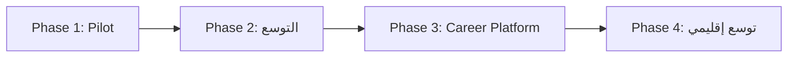

<div align="center">

# 🎓 NextStep AI

### منصة ذكية للإرشاد الأكاديمي والمهني بالذكاء الاصطناعي
**AI-Powered Academic & Career Guidance Platform**

[](#)
[](#)
[](#)

[نظرة عامة](#-نظرة-عامة) •
[المشكلة](#-المشكلة) •
[الحل](#-الحل) •
[التقنيات](#️-البنية-التقنية) •
[خطة الـ Pilot](#-خطة-الـ-pilot) •
[الفريق](#-الفريق) •
[خارطة الطريق](#-خارطة-الطريق)

</div>

---

## 📌 نظرة عامة

**NextStep AI** منصة رقمية ذكية تعمل حاليًا على الويب، تهدف لمساعدة **طلاب الثانوية العامة** و**الطلاب الجامعيين** في فلسطين على اتخاذ قرارات أكاديمية ومهنية مبنية على **بيانات حقيقية وتحليل ذكي**، بدلًا من الاعتماد على العشوائية أو آراء الآخرين.

تربط المنصة بين:

- 🎓 **الطالب**
- 🏛️ **الجامعات والكليات**
- 📚 **التخصصات الأكاديمية**
- 💼 **متطلبات سوق العمل**

بحيث تتحول رحلة الطالب من اختيار عشوائي إلى مسار مبني على البيانات والتحليل الذكي.

> يبدأ المشروع بمرحلة تجريبية **(Pilot)** بالشراكة مع **الكلية الجامعية للعلوم التطبيقية**، تستهدف دفعة الطلاب الجدد القادمة، على أن تتوسع لاحقًا لتشمل جامعات وتخصصات إضافية.

### 🎯 الرؤية

أن تصبح NextStep AI **المنصة الأولى في فلسطين** التي تستخدم الذكاء الاصطناعي لتوجيه الطلاب أكاديميًا ومهنيًا، وربط التعليم الجامعي باحتياجات سوق العمل.

### 🚀 الرسالة

تمكين كل طالب من معرفة:
- ما التخصص الأنسب له؟
- أين يمكنه دراسته؟
- ماذا يحتاج ليتطور؟
- كيف يبني مساره المهني أثناء الجامعة؟

---

## ❗ المشكلة

| الفئة | التحديات |
|---|---|
| **طلاب ما بعد الثانوية** | اختيار تخصص غير مناسب، نقص المعلومات عن الجامعات، الاعتماد على آراء الآخرين، غياب رؤية عن مستقبل التخصص |
| **الطلاب الجامعيون** | غياب إرشاد أكاديمي مستمر، صعوبة معرفة المهارات والكورسات المطلوبة، ضعف الربط بالدراسة وسوق العمل |
| **الجامعات** | صعوبة الوصول للطلاب بطريقة ذكية، نقص بيانات اهتمامات الطلاب، غياب منصة موحدة لعرض برامجها |

### 💡 البعد الإنساني

في ظل الظروف الاستثنائية التي يمر بها قطاع التعليم في غزة (انقطاع التعليم المتكرر، نقص الموارد، محدودية الإرشاد المباشر)، تمنح NextStep AI كل طالب — بغض النظر عن ظروفه أو موقعه — **فرصة متكافئة** للحصول على توجيه مبني على بيانات حقيقية، **مجانًا بالكامل** في نسختها الأساسية. هذا يجعلها أداة **عدالة تعليمية** بقدر ما هي أداة تقنية.

---

## ✅ الحل

توفر NextStep AI نظامًا متكاملًا يشمل:

1. 🔍 **منصة استكشاف** الجامعات والتخصصات
2. 🧠 **نظام تحليل شخصية وميول** الطالب (AI Assessment)
3. 🎯 **نظام توصية ذكي** للتخصصات والجامعات بنسبة توافق واضحة
4. 🤖 **مساعد أكاديمي بالذكاء الاصطناعي** (AI Advisor)
5. 📚 **نظام توصية بالكورسات والشهادات** (ميزة مدفوعة اختيارية)
6. 📊 **Dashboard** للجامعات لتحليل بيانات واهتمامات الطلاب

---

## 👥 المستخدمون المستهدفون

| الفئة | الهدف |
|---|---|
| طلاب الثانوية العامة | اختيار تخصص وجامعة مناسبة بثقة |
| الطلاب الجامعيون | تطوير المسار الأكاديمي والمهني أثناء الدراسة |
| الجامعات والكليات | عرض برامجها وفهم اهتمامات الطلاب عبر بيانات حقيقية |
| إدارة المنصة | إدارة المحتوى والتحكم الكامل بالنظام |

---

## 🧭 رحلة الطالب داخل المنصة

```
1️⃣  إنشاء الحساب        → الاسم، العمر، المدينة، المعدل، الفرع الدراسي
2️⃣  AI Assessment       → استبيان/محادثة ذكية تحلل الجانب الأكاديمي والمهارات والاهتمامات والشخصية
3️⃣  Student AI Profile  → بروفايل رقمي ذكي يوضح نقاط قوة الطالب
4️⃣  Recommendation      → تخصصات وجامعات مقترحة مع نسبة توافق
5️⃣  المتابعة (اختياري)   → كورسات ومسار تعلم مخصص بعد اختيار التخصص
```

**مثال على بروفايل طالب:**

```yaml
Ahmed Profile:
  Interest: Artificial Intelligence
  Skills:
    Programming: High
    Math: Medium
  Personality: Analytical
  Recommended Fields:
    - Data Science: 90%
    - Cyber Security: 82%
    - Computer Engineering: 75%
```

---

## 🤖 الذكاء الاصطناعي في المشروع

| المكوّن | الوظيفة |
|---|---|
| **AI Academic Advisor** | مساعد أكاديمي شخصي يجيب عن الأسئلة ويشرح التخصصات والمساقات |
| **AI Recommendation Engine** | يقترح تخصصات، جامعات، كورسات، شهادات، ومشاريع |
| **AI Career Guidance** | يساعد الطالب على معرفة الوظائف المحتملة والمهارات المطلوبة |
| **AI Analytics** | تحليل توجهات الطلاب والتخصصات الأكثر طلبًا للجامعات والمنصة |

---

## 🏗️ البنية التقنية

### خطة الـ Pilot (نطاق الويب فقط)

| الطبقة | التقنية | السبب |
|---|---|---|
| **Frontend** | React / Next.js | تطوير سريع وأداء جيد لصفحات الجامعات والتخصصات |
| **Backend** | Laravel API | متوافق مع خبرة الفريق الحالية |
| **AI Service** | Python FastAPI | يفصل منطق التوصية والمساعد الذكي عن الباكند الأساسي |
| **Database** | PostgreSQL | متينة وكافية لحجم البيانات الحالي والمستقبلي |
| **Vector Database** | Qdrant | لدعم البحث الدلالي وRAG |
| **LLM** | Claude API (أو مزود مكافئ) | للمساعد الأكاديمي بالاعتماد على بيانات الكلية (RAG) |

> 📱 نسخة تطبيق الموبايل (Flutter) مخططة للمراحل القادمة بعد الـ Pilot.

### 🧮 منطق التوصية (النسخة الأولى)

نظام **Weighted Matching** بسيط وقابل للشرح بالكامل (بدل نموذج تعلّم آلي مدرّب، لغياب بيانات تاريخية كافية حاليًا):

- كل تخصص له بروفايل من **6 أبعاد**: برمجة، رياضيات، تواصل، بحث علمي، عملي، إدارة (قيم 0–1) يُحدد بالتنسيق مع أساتذة الكلية.
- الطالب يحصل على نفس الأبعاد من إجاباته على الاستبيان الذكي.
- **نسبة التوافق = درجة التشابه** بين بروفايل الطالب وبروفايل كل تخصص.

قابل للترقية لموديل تعلّم آلي حقيقي لاحقًا عند توفر بيانات كافية.

---

## 💰 نموذج العمل

النسخة الأساسية **مجانية بالكامل** للطالب. الإيرادات تأتي من:

1. **اشتراكات الجامعات (B2B)** — صفحة رسمية + Dashboard + Analytics + نظام إرشاد
2. **الشراكات التعليمية** — نسبة من التسجيلات المُحالة لمراكز التدريب والمنصات التعليمية
3. **ميزات Premium اختيارية للطالب** — متابعة كورسات مخصصة، خطة تعلم تفصيلية

---

## 🧪 خطة الـ Pilot

**المدة:** 6–8 أسابيع

| الأسبوع | المخرجات |
|---|---|
| 1 | جمع البيانات من الكلية، تصميم الاستبيان الذكي، تصميم Schema قاعدة البيانات |
| 2 | بناء أساس الـ Backend: تسجيل الدخول، جداول الجامعات/التخصصات، لوحة إدارة بسيطة |
| 2–3 | بناء الفرونت إند: التسجيل، الملف الشخصي، صفحات الكلية والتخصصات |
| 3–4 | بناء محرك التوصية (Weighted Scoring) وربطه بواجهة الطالب |
| 4–5 | بناء المساعد الأكاديمي الذكي (AI Advisor) وربطه ببيانات التخصصات الفعلية |
| 5–6 | التكامل الكامل بين الأجزاء، اختبار السيناريو الكامل ببيانات حقيقية |
| 6–8 | الإطلاق التجريبي مع دفعة الطلاب الجدد، وجمع ملاحظات للتحسين |

### النسخة الأولى (MVP) تشمل:

**👨‍🎓 Student:** تسجيل دخول ✔ · Profile ✔ · اختبار AI ✔ · توصية تخصصات ✔ · صفحات الجامعات ✔ · صفحات التخصصات الأساسية ✔

**🏛️ University:** إنشاء صفحة جامعة ✔ · إدارة المحتوى ✔ · إضافة التخصصات ✔

**🤖 AI:** Chat Assistant ✔ · Recommendation System أولي ✔ · تحليل الاستبيان ✔

### 🚀 خطة النشر (Deployment)

| المكوّن | أداة النشر | ملاحظات |
|---|---|---|
| Frontend (Next.js) | Vercel | نشر مباشر من GitHub، خطة مجانية كافية للـ Pilot |
| Backend (Laravel API) | Railway / Render | استضافة سحابية بسيطة الإعداد ومناسبة للبدايات |
| AI Service (FastAPI) | نفس مزود الباكند أو خدمة منفصلة | يمكن فصلها لاحقًا عند زيادة الحمل |
| Database | PostgreSQL مُدارة (Managed) | نسخ احتياطي تلقائي لحماية بيانات الجامعة والطلاب |
| إدارة الكود | Git Flow + GitHub | فرع رئيسي (main) + فروع تطوير لكل ميزة |

---

## 👨‍💻 الفريق

| الاسم | الدور | المهام الأساسية |
|---|---|---|
| **أحمد الحايك** | CEO / AI Product Lead | قيادة المشروع، Product Management، Business Development، AI Architecture، التواصل مع الجامعات |
| **عيد أبو بيض** | CTO / AI Engineer | تصميم النظام، AI Services، RAG، Integration، Deployment |
| **مريم تابيل** | Frontend Engineer | تصميم الواجهات، Web Application، Student Dashboard، University Pages |
| **نداء المدهون** | Information Security / Full Stack Developer | تأمين المنصة وحماية بيانات الطلاب والجامعات، تطوير الواجهات الأمامية والخلفية، دعم فريق الـ Backend والـ Frontend عند الحاجة |
| **عمر حمدي** | Backend Engineer | Laravel Backend، Database، APIs، Authentication، Admin System |

---

## 🗺️ خارطة الطريق



| المرحلة | المحتوى |
|---|---|
| **Phase 1 — Pilot** | منصة ويب، تخصصات قسم الهندسة، شراكة أولى مع الكلية الجامعية للعلوم التطبيقية |
| **Phase 2** | إضافة جامعات وتخصصات أكثر، تطوير المساعد الأكاديمي، تحسين محرك التوصية ببيانات فعلية |
| **Phase 3** | ربط المنصة بفرص تدريب وتوظيف فعلية (Career Platform) |
| **Phase 4** | توسع إقليمي خارج فلسطين |

---

## ⚠️ المخاطر والتحديات

| المخاطرة | كيفية التعامل معها |
|---|---|
| بطء أو محدودية جمع البيانات من الجامعة | البدء بأقل بيانات كافية للتشغيل (تخصص واحد) والتوسع تدريجيًا بالتوازي مع التطوير |
| دقة نظام التوصية بدون بيانات تاريخية | استخدام Weighted Matching قابل للشرح، ومراجعته يدويًا مع الكلية قبل الإطلاق |
| تكلفة استخدام API الـ LLM قد ترتفع | مراقبة الاستهلاك أولًا بأول وضبط حدود استخدام معقولة لكل طالب |
| ضيق الوقت قبل استقبال الطلاب الجدد | تضييق نطاق الـ Pilot لويب فقط وتحديد أولويات واضحة أسبوعيًا |

---

## 🎯 الهدف النهائي

> **NextStep AI ليست منصة معلومات فقط، بل نظام ذكاء اصطناعي يرافق الطالب من لحظة اختيار التخصص حتى بناء مستقبله المهني** — بأداة مجانية الأساس، مبنية على بيانات حقيقية، وقابلة للنمو تدريجيًا مع كل شراكة جديدة.

---

<div align="center">

**إعداد:** فريق NextStep AI
**الإصدار:** 2.0 — 20 يوليو 2026

</div>
